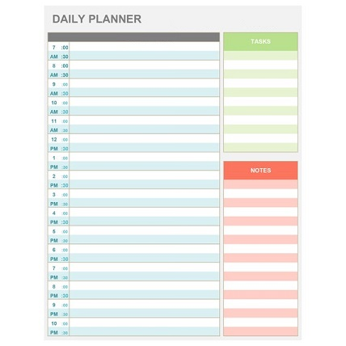
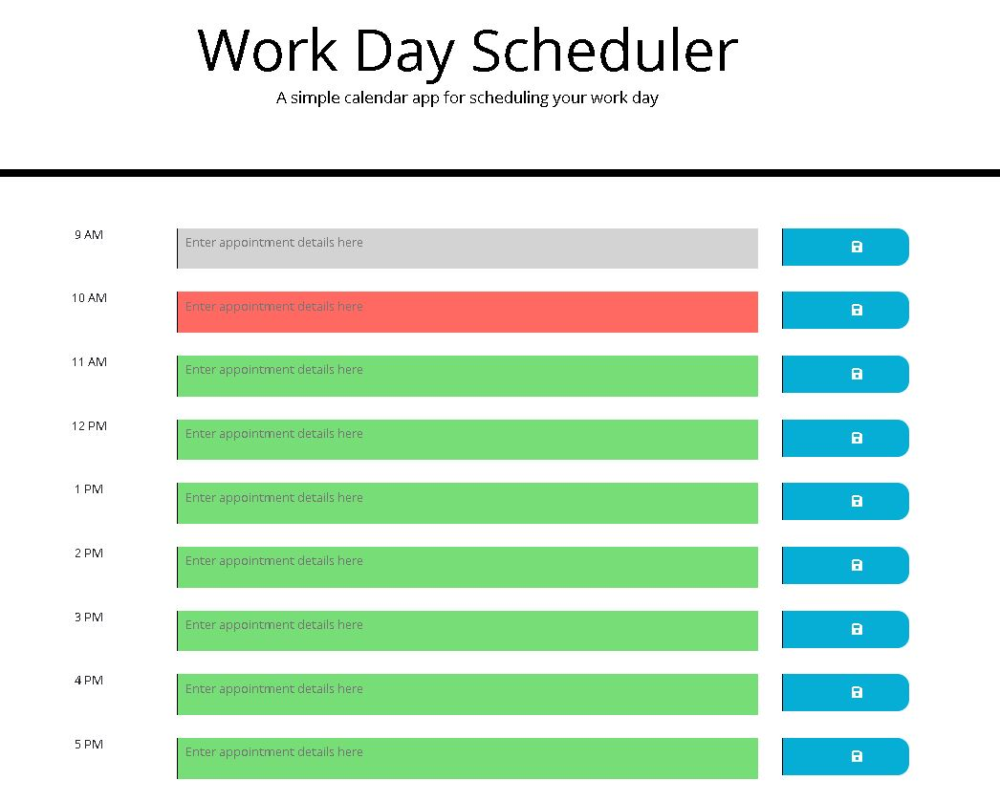

### Workday Scheduler
#

## This is a simple Workday scheduler icon. Where you enter a note or appointment in your workday scheduler and than click on the save icon. This application only allows you to schedule items on the current day between 9am and 5pm. The current time is highlighted in red and times that have not passed yet are highlighted in green.  Than you either click on Devour, or Restore. Click on the below Image which is also a link to be brought to the application which is available on github. This application uses localstorage to save your notes 
##
<a href="https://mrmikehoyt.github.io/Workdayscheduler/">

## This application uses jQuery, HTML, CSS and LocalStorage
# Built with

## Prerequistes

## Instructions
#
1.  Download Visual Studio code from https://code.visualstudio.com/download 
#
5. do a clone with https and download the source code
#
6. Open index.html

